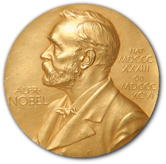

# 🥇 History of Nobel Prize Winners 🥇

The Nobel Prize has been among the most prestigious international awards since 1901. Each year, awards are bestowed in chemistry, literature, physics, physiology or medicine, economics, and peace. In addition to the honor, prestige, and substantial prize money, the recipient also gets a gold medal with an image of Alfred Nobel (1833 - 1896), who established the prize.

The Nobel Foundation has made a dataset available of all prize winners from the outset of the awards from 1901 to 2023. The dataset used in this project is from the Nobel Prize API and is available in the `nobel.csv` file in the `data` folder.

In this proyect I analyzed the Nobel Prize winner data to identify patterns by answering the following questions:
- What is the most commonly awarded gender and birth country?
- Which decade had the highest ratio of US-born Nobel Prize winners to total winners in all categories?
- Which decade and Nobel Prize category combination had the highest proportion of female laureates?
- Who was the first woman to receive a Nobel Prize, and in what category?
- Which individuals or organizations have won more than one Nobel Prize throughout the years?
